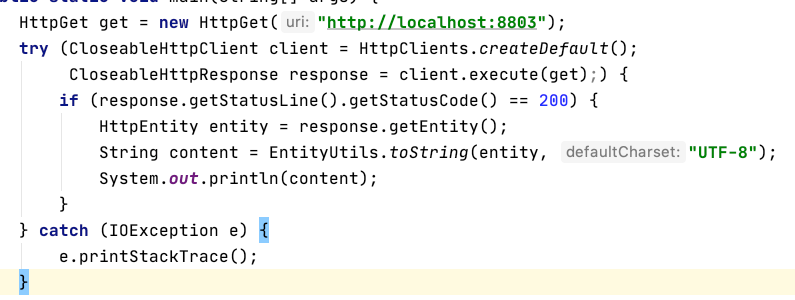
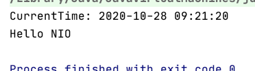

#### 电脑配置
`2.3 GHz 四核Intel Core i5`

`8 GB 2133 MHz LPDDR3`

### 01 使用 GCLogAnalysis.java 自己演练一遍串行/并行/CMS/G1的案例
平均每次生成对象数量：
| GC/最大堆内存 | 512M | 1024M | 2048M | 4G |
| ------ | ------ | ------ | ------ | ------ |
| SerialGC | 10599 | 11653 | 12700 | 10099 |
| ParallelGC | 8437 | 12696 | 13735 | 11725 |
| CMS GC | 10511 | 13229 | 12785 | 12204 |
| G1 GC | 10463 | 12974 | 10261 | 11774 |

GC发生次数以及系统暂停时间：
| GC/最大堆内存 | 512M | 1024M | 2048M | 4G |
| ------ | ------ | ------ | ------ | ------ |
| SerialGC | 7次Young GC平均每次耗时0.03秒;9次Full GC平均每次耗时0.04秒 | 8次Young GC，平均每次程耗时0.05秒;1次Full GC耗时0.08秒 | 4次Young GC,平均每次程耗时0.08秒 | 2次Young GC,平均每次程耗时0.13秒 |
| ParallelGC | 26次Young GC,平均每次耗时0.02秒；11次Full GC平均每次耗时0.03秒 | 20次Young GC,平均每次耗时0.02秒；1次Full GC耗时0.05秒 | 7次Young GC,平均每次耗时0.02秒 | 3次Young GC,平均每次耗时0.1秒 |
| CMS GC | 12次GC,平均每次耗时0.02秒;5次Full GC，平均每次耗时0.05秒 | 10次GC,平均每次耗时0.04秒;1次Full GC耗时0.06秒 | 6次GC,平均每次耗时0.06秒 |  6次GC,平均每次耗时0.07秒 |
| G1 GC | 36次Young GC,mixed GC 32次 | 12次Young GC平均每次耗时0.015秒，9次mixed GC平均每次耗时0.006秒 | 12次Young GC平均每次耗时0.02秒 | 12次Young GC平均每次耗时0.03秒 |

总结：
1. 一般情况下，随着堆内存的增大，GC次数在减少、每次GC消耗时间和每次生成的对象数量在增加，即堆内存越大、性能越好
2. 但堆内存并不是越大越好，存在一个阈值，当堆内存达到这个值的时候，GC的性能不再提升，且会有所下降

### 02 使用压测工具(wrk或sb)，演练gateway-server-0.0.1-SNAPSHOT.jar 示例
使用命令示例：`wrk -t 16 -c 400 -d 30s http://localhost:8088/api/hello`

平均每秒处理完成请求个数：
| GC/最大堆内存 | 512M | 1024M | 2048M | 4G |
| ------ | ------ | ------ | ------ | ------ |
| SerialGC | 36809.88 | 50930.29 | 51509.89 | 53891.20 |
| ParallelGC | 26137.95 | 50930.29 | 53314.46 | 55388.69 |
| CMS GC | 38546.85 | 49560.19 | 51589.89 | 55394.46 |
| G1 GC | 33695.94 | 50237.81 | 48396.02 | 55430.82 |

平均每秒读取数据：
| GC/最大堆内存 | 512M | 1024M | 2048M |
| ------ | ------ |------ |------ |
| SerialGC | 4.39MB | 5.22MB | 6.15MB |
| ParallelGC | 3.12MB | 6.08MB | 6.37MB |
| CMS GC | 4.60MB | 5.92MB | 6.16MB |
| G1 GC | 4.02MB | 6.00MB | 5.78MB |
 
总结：如上表所示，GC堆内存相同时，各个版本的 GC 压测结构都差不多。
 
### 03 写一段代码，使用HttpClient或OkHttp访问 http://localhost:8803，代码提交到 github。
添加 Maven 依赖
```
<dependency>
	<groupId>org.apache.httpcomponents</groupId>
	<artifactId>httpclient</artifactId>
	<version>4.3.5</version>
</dependency>

<dependency>
	<groupId>org.apache.commons</groupId>
	<artifactId>commons-io</artifactId>
	<version>1.3.2</version>
</dependency>
```

Code:



result:



