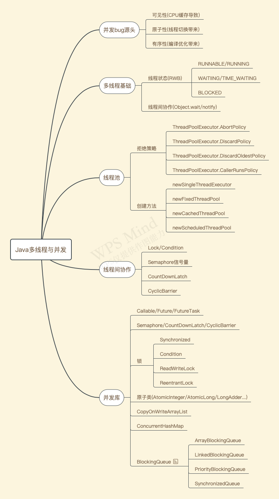

### 作业一：使用尽可能多的方式，在一个main函数里面启动一个新线程，运行一个方法并在拿到该方法的返回值后退出主线程

方法1
```
public class Homework03 {
	public static void main(String[] args) throws ExecutionException, InterruptedException {
		long start = System.currentTimeMillis();
		// 在这里创建一个线程或线程池
		ExecutorService executorService = Executors.newCachedThreadPool();
		// 异步执行 下面方法
		Future<Integer> future = executorService.submit(new Callable<Integer>() {
			@Override
			public Integer call() throws Exception {
				return sum();
			}
		});
		int result = future.get();
	
	//        int result = sum(); //这是得到的返回值
	
		// 确保  拿到result 并输出
		System.out.println("异步计算结果1为：" + result);
	
		System.out.println("使用时间：" + (System.currentTimeMillis() - start) + " ms");
	
		// 然后退出main线程
		executorService.shutdown();
	}
}
```

方法2
```
public class Homework03 {
	public static void main(String[] args) throws ExecutionException, InterruptedException {
		long start = System.currentTimeMillis();
		// 在这里创建一个线程或线程池
		FutureTask<Integer> futureTask = new FutureTask<>(new Callable<Integer>() {
			@Override
			public Integer call() throws Exception {
				return sum();
			}
		});
		executorService.submit(futureTask);
		int result = futureTask.get();
	   
	//        int result = sum(); //这是得到的返回值
	
		// 确保  拿到result 并输出
		System.out.println("异步计算结果为：" + result);
	
		System.out.println("使用时间：" + (System.currentTimeMillis() - start) + " ms");
	
		// 然后退出main线程
		executorService.shutdown();
	}
}
```

方法3
```
public class Homework03 {
	public static void main(String[] args) throws ExecutionException, InterruptedException {
		long start = System.currentTimeMillis();
		// 在这里创建一个线程或线程池
		Thread thread = new Thread(new Runnable() {
			@Override
			public void run() {
				int result1 = sum();
				System.out.println("异步计算结果为：" + result1);
			}
		});
		thread.start();
		thread.join();
	//        int result = sum(); //这是得到的返回值
	
		// 确保  拿到result 并输出
		System.out.println("异步计算结果为：" + result);
	
		System.out.println("使用时间：" + (System.currentTimeMillis() - start) + " ms");
	
		// 然后退出main线程
	}
}
```


方法4
```
public class Homework03 {
	public static void main(String[] args) throws ExecutionException, InterruptedException {
		long start = System.currentTimeMillis();
		// 在这里创建一个线程或线程池
		int[] result = new int[1];
		new Thread(new Runnable() {
			@Override
			public void run() {
				synchronized (Homework03.class) {
					result[0] = sum();
					Homework03.class.notifyAll();
				}
			}
		}).start();
	//        int result = sum(); //这是得到的返回值
		synchronized (Homework03.class) {
			Homework03.class.wait();
		}
		// 确保  拿到result 并输出
		System.out.println("异步计算结果为：" + result);
	
		System.out.println("使用时间：" + (System.currentTimeMillis() - start) + " ms");
	
		// 然后退出main线程
		executorService.shutdown();
	}
}
```

方法5
```
public class Homework03 {
	public static void main(String[] args) throws ExecutionException, InterruptedException {
		long start = System.currentTimeMillis();
		// 在这里创建一个线程或线程池
		  CompletableFuture<Integer> future = CompletableFuture.supplyAsync(new Supplier<Integer>() {
			@Override
			public Integer get() {
				return sum();
			}
		});
		int result = future.get();
		
	//        int result = sum(); //这是得到的返回值
	
		// 确保  拿到result 并输出
		System.out.println("异步计算结果为：" + result);
	
		System.out.println("使用时间：" + (System.currentTimeMillis() - start) + " ms");
	
		// 然后退出main线程
	}
}
```

方法6
```
public class Homework03 {
	public static void main(String[] args) throws ExecutionException, InterruptedException {
		long start = System.currentTimeMillis();
		// 在这里创建一个线程或线程池
		ReentrantLock lock = new ReentrantLock();
		Condition condition = lock.newCondition();
		int[] result = new int[1];
		new Thread(new Runnable() {
			@Override
			public void run() {
				try {
					lock.lock();
					condition.signal();
					result[0] = sum();
				} finally {
					lock.unlock();
				}
			}
		}).start();
		
	//        int result = sum(); //这是得到的返回值
	
	   try {
			lock.lock();
			condition.await();
			// 确保  拿到result 并输出
			System.out.println("异步计算结果1为：" + result[0]);
	
			System.out.println("使用时间：" + (System.currentTimeMillis() - start) + " ms");
		}finally {
			lock.unlock();
		}
	}
}
```

方法7
```
public class Homework03 {
	public static void main(String[] args) throws ExecutionException, InterruptedException {
		long start = System.currentTimeMillis();
		// 在这里创建一个线程或线程池
		Semaphore semaphore = new Semaphore(0);
	
		int[] result = new int[1];
		new Thread(new Runnable() {
			@Override
			public void run() {
				result[0] = sum();
				semaphore.release();
			}
		}).start();
	//        int result = sum(); //这是得到的返回值
	
		semaphore.acquire();
		// 确保  拿到result 并输出
		System.out.println("异步计算结果1为：" + result[0]);
	
		System.out.println("使用时间：" + (System.currentTimeMillis() - start) + " ms");
	}
}
```

方法8
```
public class Homework03 {
	public static void main(String[] args) throws ExecutionException, InterruptedException {
		long start = System.currentTimeMillis();
		// 在这里创建一个线程或线程池
		CyclicBarrier cyclicBarrier = new CyclicBarrier(2);
	
		int[] result = new int[1];
		new Thread(new Runnable() {
			@Override
			public void run() {
				try {
					result[0] = sum();
					cyclicBarrier.await();
				} catch (InterruptedException | BrokenBarrierException e) {
					e.printStackTrace();
				}
			}
		}).start();
	//        int result = sum(); //这是得到的返回值
	
		// 确保  拿到result 并输出
		try {
			cyclicBarrier.await();
			// 确保  拿到result 并输出
			System.out.println("异步计算结果1为：" + result[0]);
	
			System.out.println("使用时间：" + (System.currentTimeMillis() - start) + " ms");
		} catch (BrokenBarrierException e) {
			e.printStackTrace();
		}
	}
}
```

方法9
```
public class Homework03 {
	public static void main(String[] args) throws ExecutionException, InterruptedException {
		long start = System.currentTimeMillis();
		// 在这里创建一个线程或线程池
		CountDownLatch countDownLatch = new CountDownLatch(1);
	
		int[] result = new int[1];
		new Thread(new Runnable() {
			@Override
			public void run() {
				result[0] = sum();
				countDownLatch.countDown();
			}
		}).start();
	//        int result = sum(); //这是得到的返回值
	
		countDownLatch.await();
		// 确保  拿到result 并输出
		System.out.println("异步计算结果1为：" + result[0]);
	
		System.out.println("使用时间：" + (System.currentTimeMillis() - start) + " ms");
	}
}
```

### 作业二：梳理多线程与并发相关的知识

